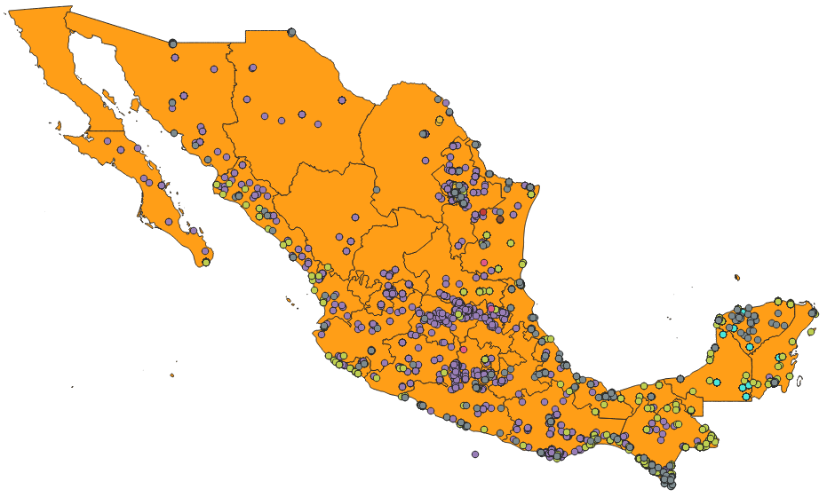

<h1 align="center">Geovisualization of the main culicidae, vectors of disease transmission that put the Mexican population at risk</h1>

 

## Author 
- [Ashley Dafne Aguilar Salinas - UNAM ENES Morelia](https://github.com/AshleyDafneAguilar)

## Abstract
The following work aims to perform geo-spatial visualizations of the main culicidae, causative agents of diseases such as leishmaniasis,
dengue and malaria in Mexico; to observe the behavior of some of their climatic conditions during different periods of time. The set of culicidae
species that were chosen for the analysis of this project was based on the information provided by the articles [4, 7, 12]. The data collection of
these species was downloaded from the GBIF platform. Each of the data collection was filtered to obtain the desired information, these filters
are specified in each link [5, 6, 8, 9, 11]

## Introduction 
Vector-borne diseases are human diseases, with a complex transmission cycle, caused by a great diversity of bacteria, parasites or viruses that are transmitted by some organisms.  These diseases represent a high burden of morbidity and mortality in some communities, causing around 700,000 deaths worldwide, according to data from the World Health Organization (WHO). They also require an overload in the health systems of the countries and high costs.
According to the Pan American Health Organization (PAHO), in recent years, health systems in the Americas region have faced the challenge of improving epidemiological surveillance of vector-borne diseases to control mosquito populations and prevent the transmission of diseases such as malaria or dengue and leishmaniasis, which are endemic diseases in the region, as well as new arboviruses.

The vector-borne diseases of interest in this project are leishmaniasis, whose causal agent is the bite of the insect lutzomyia olmeca olmeca and potentially also lutzomyia cruciata. Malaria, whose vector of transmission are the mosquitoes of the genus Anopheles, mainly in Mexico the species albimanus and pseudopunctipennis. Finally, dengue, a disease transmitted by mosquitoes of the genus aedes, is studied. The main causative species in the country are aegypti, hendersoni, zoosophus dyar and knab, triseriatus and brelandi zavortink.

The objective of performing a geospatial visualization of the presence of the main species that cause vector-borne diseases of interest in Mexico is to observe the behavior of some of their climatic conditions (mean annual temperature, precipitation and elevation) during different periods of time. It is hoped that this information will be useful in national studies to control mosquito populations of these species and prevent the transmission of the diseases studied or some others in which these mosquitoes are vectors.

## References
- [1] Leishmaniasis. (2024, 25 marzo). OPS/OMS | Organización Panamericana de la Salud. https://www.paho.org/es/temas/leishmaniasis
- [2] Leishmaniasis cutánea y mucosa. (s. f.). OPS/OMS | Organización Panamericana de la Salud. https://www.paho.org/es/temas/leishmaniasis/leishmaniasis-cutanea-mucosa
- [3]World Health Organization: WHO. (2023, 12 enero). Leishmaniasis. https://www.who.int/es/news-room/fact-sheets/detail/leishmaniasis
- [4] Méndez-Pérez, C., & Rebollar-Téllez, E. A. (2012). Análisis morfométrico de poblaciones alopátricas de Lutzomyia olmeca olmeca y Lutzomyia cruciata (Diptera: Psychodidae: Phlebotominae), vectores principales de la leishmaniasis cutánea en el sureste de México. Revista Biomédica, 23(1), 7-21. https://doi.org/10.32776/revbiomed.v23i1.91
- [5] GBIF.org (28 March 2024) GBIF Occurrence Download  https://doi.org/10.15468/dl.jmmvrh 
- [6] GBIF.org (8 April 2024) GBIF Occurrence Download https://doi.org/10.15468/dl.gdebqv
- [7] Villarreal-Treviño C, Ríos-Delgado JC, Penilla-Navarro RP, et al. Composición y abundancia de especies de anofelinos según la diversidad de hábitats en México. salud publica mex. 2020;62(4):388-401.
- [8] GBIF.org (08 April 2024) GBIF Occurrence Download https://doi.org/10.15468/dl.n5n8t6
- [9] GBIF.org (08 April 2024) GBIF Occurrence Download https://doi.org/10.15468/dl.fvh4kn
- [10] Diez enfermedades transmitidas por vectores que ponen en riesgo a la población de las Américas. (s. f.). OPS/OMS | Organización Panamericana de la Salud. https://www.paho.org/es/noticias/7-4-2014-diez-enfermedades-transmitidas-por-vectores-que-ponen-riesgo-poblacion-americas
- [11] GBIF.org (15 April 2024) GBIF Occurrence Download  https://doi.org/10.15468/dl.y89wuj
- [12] Adelfo Sánchez Trinidad, Félix Ordoñez Sánchez y otros (2014) Geographical distribution of the Aedes Triseriatus Group (Diptera: Culicidae) in Mexico. 
