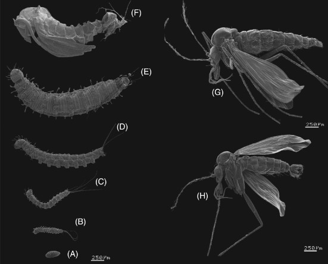

<h1 align="center">Geovisualization of Lutzomyia Cruciata and Lutzomyia Olmeca Olmeca (Psychodidae), main vectors of leishmaniasis transmission in Mexico</h1>

## Author 
- [Ashley Dafne Aguilar Salinas - UNAM ENES Morelia](https://github.com/AshleyDafneAguilar)

## Introduction 
Leishmaniasis is a vector-borne parasitic and zoonotic disease with a complex transmission cycle involving a great diversity of parasites, reservoirs and vectors.  It is caused by different species of protozoa of the genus **Leishmania** that are transmitted through the bite of insects of the family **Psychodidae** [1].

Three main forms of leishmaniasis are known: *visceral*, *cutaneous* and *mucocutaneous*. In the American region, *cutaneous leishmaniasis* is considered the usual form; it is registered in 21 countries and is endemic in 19. Mexico is one of them, specifically in the Yucatan Peninsula. 
The causative agent of *Leishmania mexicana* is transmitted to humans by the bite of the insect vector **Lutzomyia olmeca olmeca** and potentially also by **Lutzomyia cruciata** [4].

## Objectives
Some ideas are to perform cluster analysis, visualize the behavior of the clusters over the years, identify the ecological niche of the species to find possible points of presence in all of Mexico, since the data are only shown in Southeast Mexico, etc.

## References
- [1] Leishmaniasis. (2024, 25 marzo). OPS/OMS | Organización Panamericana de la Salud. https://www.paho.org/es/temas/leishmaniasis
- [2] Leishmaniasis cutánea y mucosa. (s. f.). OPS/OMS | Organización Panamericana de la Salud. https://www.paho.org/es/temas/leishmaniasis/leishmaniasis-cutanea-mucosa
- [3]World Health Organization: WHO. (2023, 12 enero). Leishmaniasis. https://www.who.int/es/news-room/fact-sheets/detail/leishmaniasis
- [4] Méndez-Pérez, C., & Rebollar-Téllez, E. A. (2012). Análisis morfométrico de poblaciones alopátricas de Lutzomyia olmeca olmeca y Lutzomyia cruciata (Diptera: Psychodidae: Phlebotominae), vectores principales de la leishmaniasis cutánea en el sureste de México. Revista Biomédica, 23(1), 7-21. https://doi.org/10.32776/revbiomed.v23i1.91
- [5] GBIF.org (28 March 2024) GBIF Occurrence Download  https://doi.org/10.15468/dl.jmmvrh
