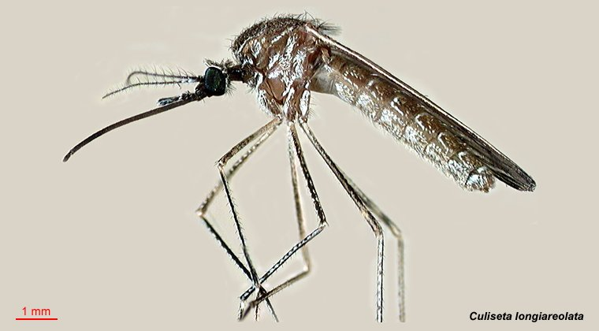

<h1 align="center">Geovisualization of the main culicidae, vectors of disease transmission that put the Mexican population at risk</h1>

## Author 
- [Ashley Dafne Aguilar Salinas - UNAM ENES Morelia](https://github.com/AshleyDafneAguilar)

## Introduction 

## Objectives
Some ideas are to perform cluster analysis, visualize the behavior of the clusters over the years, identify the ecological niche of the species to find possible points of presence in all of Mexico, since the data are only shown in Southeast Mexico, etc.

## References
- [1] Leishmaniasis. (2024, 25 marzo). OPS/OMS | Organización Panamericana de la Salud. https://www.paho.org/es/temas/leishmaniasis
- [2] Leishmaniasis cutánea y mucosa. (s. f.). OPS/OMS | Organización Panamericana de la Salud. https://www.paho.org/es/temas/leishmaniasis/leishmaniasis-cutanea-mucosa
- [3]World Health Organization: WHO. (2023, 12 enero). Leishmaniasis. https://www.who.int/es/news-room/fact-sheets/detail/leishmaniasis
- [4] Méndez-Pérez, C., & Rebollar-Téllez, E. A. (2012). Análisis morfométrico de poblaciones alopátricas de Lutzomyia olmeca olmeca y Lutzomyia cruciata (Diptera: Psychodidae: Phlebotominae), vectores principales de la leishmaniasis cutánea en el sureste de México. Revista Biomédica, 23(1), 7-21. https://doi.org/10.32776/revbiomed.v23i1.91
- [5] GBIF.org (28 March 2024) GBIF Occurrence Download  https://doi.org/10.15468/dl.jmmvrh 
- [6] GBIF.org (8 April 2024) GBIF Occurrence Download https://doi.org/10.15468/dl.gdebqv
- [7] Villarreal-Treviño C, Ríos-Delgado JC, Penilla-Navarro RP, et al. Composición y abundancia de especies de anofelinos según la diversidad de hábitats en México. salud publica mex. 2020;62(4):388-401.
- [8] GBIF.org (08 April 2024) GBIF Occurrence Download https://doi.org/10.15468/dl.n5n8t6
- [9] GBIF.org (08 April 2024) GBIF Occurrence Download https://doi.org/10.15468/dl.fvh4kn
- [10]https://www.paho.org/es/noticias/7-4-2014-diez-enfermedades-transmitidas-por-vectores-que-ponen-riesgo-poblacion-americas
- [11] GBIF.org (15 April 2024) GBIF Occurrence Download  https://doi.org/10.15468/dl.y89wuj
